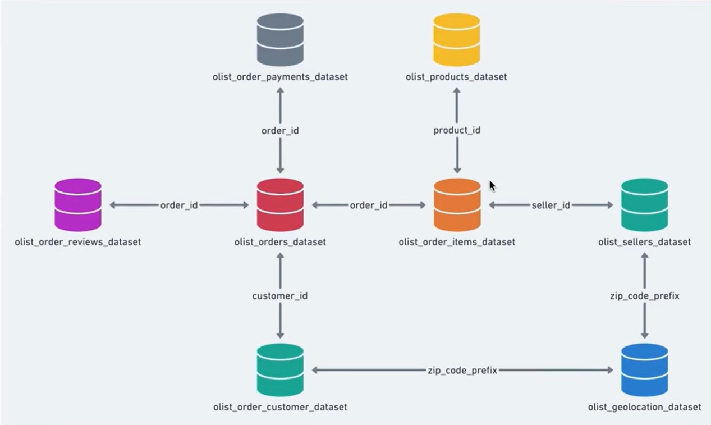

# Target Brazil E-Commerce SQL Analysis

## Project Overview

This project analyzes Target Brazil's e-commerce operations using SQL Server. The objective is to uncover insights related to customer behavior, order growth, freight costs, delivery performance, and payment patterns.

## Business Problem

The goal was to analyze e-commerce data and answer key business questions related to:

- Customer distribution
- Order growth trends
- Monthly seasonality
- Freight costs
- Delivery performance
- Payment behavior

## Dataset Information

The project uses the Olist Brazilian E-Commerce Dataset consisting of:

- Customers
- Orders
- Order Items
- Products
- Payments
- Sellers
- Geolocation
- Reviews

## Database Schema

## SQL Skills Demonstrated

- Joins
- Aggregate Functions
- Date Functions
- CTEs
- CASE Statements
- Data Exploration
- Business Analytics

## Key Findings

### Strong E-Commerce Growth

The dataset spans 25 months from September 2016 to October 2018. Orders grew significantly throughout the analysis period.

### Seasonal Demand

Order volumes peaked during November and December, indicating strong holiday-season demand.

### Freight Cost Analysis

States such as RR, PB, RO, AC, and PI showed the highest average freight costs.

### Delivery Performance

Several states consistently received orders earlier than estimated delivery dates.

## Repository Structure

- SQL Scripts
- Images
- Dataset
- Problem Statement

## Project Outcome

This analysis demonstrates how SQL Server can be used to transform raw transactional data into actionable business insights for decision-making.
